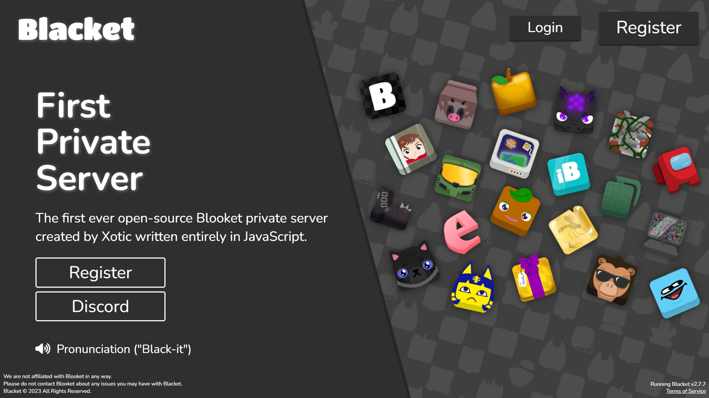

<div id="top"></div>
<br />
<div align="center">
  <a href="https://blacket.org">
    
  </a>
  <h3 align="center">Blacket</h3>

  <p align="center">
    The first ever open-source Blooket private server created by Xotic written entirely in JavaScript. 
    <br />
    <a href="https://github.com/XoticLLC/Blacket/wiki"><strong>Get Help</strong></a>
    <br />
    <a href="https://github.com/XoticLLC/Blacket/issues">Report Bug</a>
    <a href="https://github.com/XoticLLC/Blacket/issues">Request Feature</a>
  </p>
</div>

<details>
  <summary>Table of Contents</summary>
  <ol>
    <li>
      <a href="#about-the-project">About The Project</a>
    </li>
    <li>
      <a href="#getting-started">Getting Started</a>
      <ul>
        <li><a href="#prerequisites">Prerequisites</a></li>
        <li><a href="#installation">Installation</a></li>
      </ul>
    </li>
    <li><a href="#license">License</a></li>
  </ol>
</details>

## About The Project
</img>
I absolutely love Blooket and almost everything about it, but always felt something was missing from it. Some very experienced developers have created Blooket cheats / hacks for the game, but not many have made something for Blooket as a whole. I have always wanted to create my own custom packs, blooks, games, and more. This is why I created Blacket, the first ever open-source Blooket private server.
<p align="right">(<a href="#top">back to top</a>)</p>

## Getting Started

Having any debian server should be good for Blacket. If you don't know where to start, I would recommend <a href="https://linode.com">Linode</a> for beginners.

### Prerequisites

The following packages need to be installed before starting:

* NodeJS

  ```sh
  cd ~
  curl -sL https://deb.nodesource.com/setup_20.x -o /tmp/nodesource_setup.sh
  sudo bash /tmp/nodesource_setup.sh
  sudo apt install nodejs
  ```

* MySQL

  ```sh
  sudo apt update
  sudo apt-get install mysql-server
  ```
  _Follow the instructions for all of the packages that will show on screen._
  
### Installation

1. Clone the repository into your home folder:
   ```sh
   cd /tmp
   git clone https://github.com/XoticLLC/Blacket.git
   mv -v /tmp/Blacket-master ~/blacket
   ```
   
2. Move to the frontend directory and install dependencies:
   ```sh
   cd ~/blacket/frontend
   npm i
   ```
  
3. Build the react app:
   ```sh
   npm run build
   ```

4. Move to the backend directory and install dependencies:
   ```sh
   cd ../backend
   npm i
   ```

5. Start an instance of Blacket:
   ```sh
   node .
   ```

6. Open <a href=http://localhost:3000>localhost:3000</a> in your browser to finish setting up your Blacket instance.

<p align="right">(<a href="#top">back to top</a>)</p>

## License

Distributed under the GPL-3.0 License. See `LICENSE` for more information.

<p align="right">(<a href="#top">back to top</a>)</p>