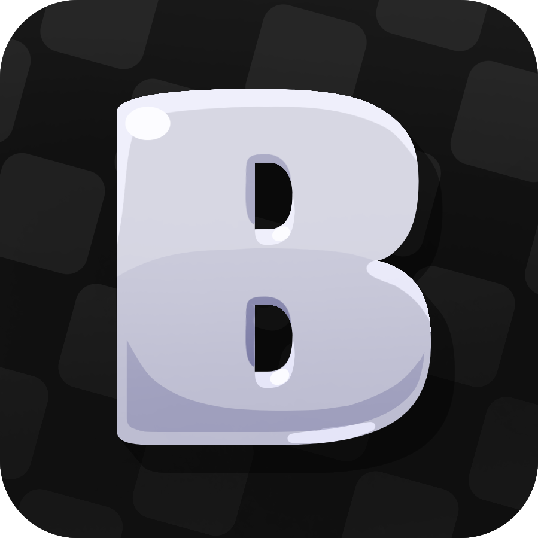

<!-- Cover -->
<h1 align="center">
	 
	
	 
	Blacket
	 
</h1>

<h4 align="center">A Blooket inspired game with countless additonal features for your enjoyment and all <a href="#license">Open Source</a>.</h4>

<!-- Badges -->

	
	
	
	
	
	
	

	
	
	

<!-- Navigation -->

	<a href="#features">Features</a> •
    <a href="#selfhost">Selfhosting</a> •
    <a href="#credits">Credits</a> •
	<a href="#license">License</a>

## Features

Blacket is a Blooket inspired game with many many additional features when compared to Blooket, we're also always looking for new exciting features to add to the game so feel free to suggest them over at our Discord! Here are some of the features we have so far:

<!-- TODO: redo this and make it not just a bullet point list, add some info on each feature and images -->
- Pack unlocking
- Custom packs
- Chat
- Friending
- Trading
- Leaderboards
- Quests
- Bazaar

(<a href="#top">back to top</a>)

## Selfhost

⚠️ UNDER CONSTRUCTION ⚠️

Selfhosting instructions will be available once Blacket v3 is in a release ready state. Feel free to try setting it up yourself in the meantime but we provide no support or help with this.

(<a href="#top">back to top</a>)

## Credits

These amazing people have contributed greatly to Blacket over it's development:
- [Xotic](https://github.com/XOTlC) - Lead Developer and founder of Blacket
- [Syfe](https://github.com/ItsSyfe) - Developer and contributor for Blacket (also wrote this README)

(<a href="#top">back to top</a>)

## License

Distributed under the GPL-3.0 License. See `LICENSE` for more information.

(<a href="#top">back to top</a>)

---

The above README is a work in progress and will be updated with previews as well as other information as we get closer to a release ready state for Blacket v3, feel free to make a PR to imrpove this README with some writeups etc.